> 文章来源： https://mp.weixin.qq.com/s/q1BGBbpSWZVqgbEzQ-5Ufg

大家好，本文将详细指导如何从零开始构建完整的Llama 3模型架构，并在自定义数据集上执行训练和推理。

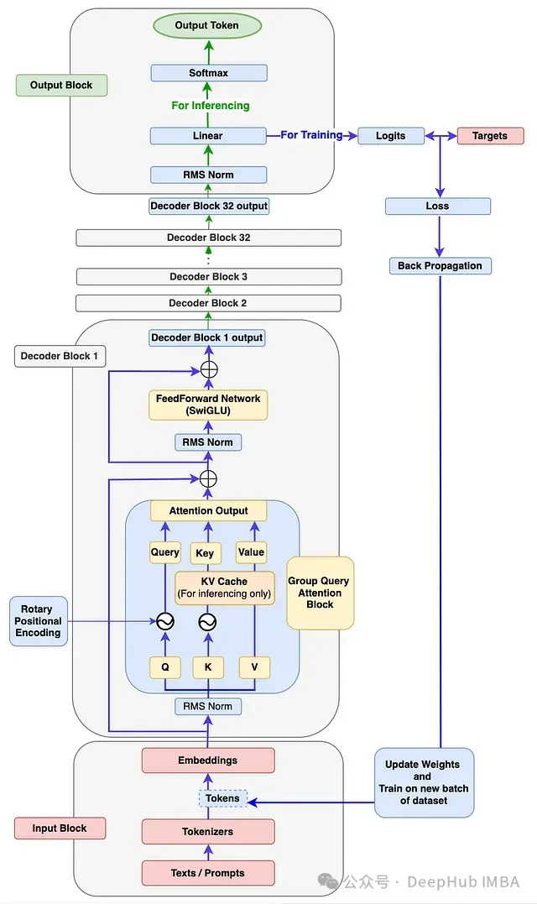
图1：Llama 3架构展示训练和推理流程。因为官方Llama 3论文中未提供相关图表。所以此图为大概架构图，阅读本文后你应能绘制出更为精确的架构图。

# 本文目标

通过本文。你可以了解到:

1. 深入理解Llama 3模型各组件的底层工作原理。

2. 编写代码构建Llama 3的每个组件，并将它们组装成一个功能完整的Llama 3模型。

3. 编写代码使用新的自定义数据集训练模型。

4. 编写代码执行推理，使Llama 3模型能够根据输入提示生成新文本。


# 1、输入模块

如图1所示，输入模块包含三个组件：文本/提示、分词器和嵌入。

输入模块内部工作流程

让我们通过下图了解输入模块内的工作流程。

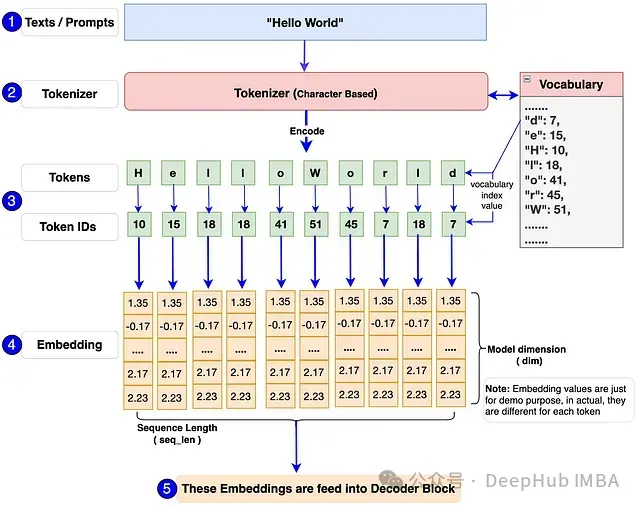
图2：输入模块流程图，展示提示、分词器和嵌入流程。

首先，单个或批量文本/提示被输入模型。例如：图中的"Hello World"。

输入模型的必须是数字格式，因为模型无法直接处理文本。分词器将这些文本/提示转换为标记ID（词汇表中标记的索引号表示）。我们将使用Tiny Shakespeare数据集构建词汇表并训练模型。Llama 3模型使用TikToken作为分词器，这是一种子词分词器。但是我们这个实现将使用字符级分词器。这样做的主要原因是让我们能够自行构建词汇表和分词器，包括编码和解码函数，这样可以深入理解底层工作原理并完全掌控代码。

每个标记ID将被转换为128维的嵌入向量（原始Llama 3 8B中为4096维）。然后这些嵌入将被传递到下一个解码器模块。

输入模块代码实现：

```python
# 导入必要的库
import torch
from torch import nn
from torch.nn import functional as F

import math
import numpy as np
import time
from dataclasses import dataclass
from typing import Optional, Tuple, List
import pandas as pd
from matplotlib import pyplot as plt

### 步骤1: 输入模块 ###

# 使用Tiny Shakespeare数据集实现字符级分词器。部分字符级分词器代码参考自Andrej Karpathy的GitHub仓库
# (https://github.com/karpathy/nanoGPT/blob/master/data/shakespeare_char/prepare.py)
# 加载tiny_shakespeare数据文件 (https://github.com/tamangmilan/llama3/blob/main/tiny_shakespeare.txt)

device: str = 'cuda' if torch.cuda.is_available() else 'cpu'  # 根据可用性分配设备为cuda或cpu

# 加载tiny_shakespeare数据文件
with open('tiny_shakespeare.txt', 'r') as f:
    data = f.read()

# 通过提取tiny_shakespeare数据中的所有唯一字符准备词汇表
vocab = sorted(list(set(data)))

# 训练Llama 3模型需要额外的标记，如<|begin_of_text|>、<|end_of_text|>和<|pad_id|>，将它们添加到词汇表中
vocab.extend(['<|begin_of_text|>', '<|end_of_text|>', '<|pad_id|>'])
vocab_size = len(vocab)

# 创建字符与词汇表中对应整数索引之间的映射。
# 这对于构建分词器的编码和解码函数至关重要。
itos = {i: ch for i, ch in enumerate(vocab)}
stoi = {ch: i for i, ch in enumerate(vocab)}


# 分词器编码函数：输入字符串，输出整数列表
def encode(s):
    return [stoi[ch] for ch in s]


# 分词器解码函数：输入整数列表，输出字符串
def decode(l):
    return ''.join(itos[i] for i in l)


# 定义稍后在模型训练中使用的张量标记变量
token_bos = torch.tensor([stoi['<|begin_of_text|>']], dtype=torch.int, device=device)
token_eos = torch.tensor([stoi['<|end_of_text|>']], dtype=torch.int, device=device)
token_pad = torch.tensor([stoi['<|pad_id|>']], dtype=torch.int, device=device)

prompts = "Hello World"
encoded_tokens = encode(prompts)
decoded_text = decode(encoded_tokens)

### 输入模块代码测试 ###
# 取消下面的三重引号来执行测试
"""  
print(f"Shakespeare文本字符长度: {len(data)}")  
print(f"词汇表内容: {''.join(vocab)}\n")  
print(f"词汇表大小: {vocab_size}")  
print(f"编码后的标记: {encoded_tokens}")  
print(f"解码后的文本: {decoded_text}")  
"""
### 测试结果: ###
"""  
Shakespeare文本字符长度: 1115394  
词汇表内容:  
 !$&',-.3:;?ABCDEFGHIJKLMNOPQRSTUVWXYZabcdefghijklmnopqrstuvwxyz<|begin_of_text|><|end_of_text|><|pad_id|>  

词汇表大小: 68  
编码后的标记: [20, 43, 50, 50, 53, 1, 35, 53, 56, 50, 42]  
解码后的文本: Hello World  
"""
```

# 2、解码器模块

参照图1的架构图，解码器模块包含以下子组件：

- RMS归一化

- 旋转位置编码

- KV缓存

- 分组查询注意力

- 前馈网络

- 解码器块

## RMS归一化（Root Mean Square Normalization）

### RMSNorm的必要性 

从图1可以看出，输入模块的输出（嵌入向量）经过RMSNorm模块。这是因为嵌入向量具有多个维度（Llama3-8b中为4096维），可能出现不同范围的值。这会导致模型梯度爆炸或消失，从而导致收敛缓慢甚至发散。而RMSNorm将这些值归一化到一定范围，有助于稳定和加速训练过程。这使得梯度具有更一致的幅度，从而加快模型收敛。

### RMSNorm的工作原理 

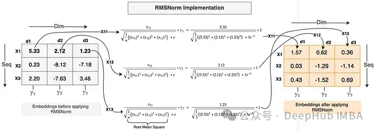

图3：对形状为[3,3]的输入嵌入应用RMSNorm

类似于层归一化，RMSNorm沿嵌入特征或维度应用。上图中的嵌入形状为[3,3]，意味着每个标记有3个维度。

示例：对第一个标记X1的嵌入应用RMSNorm：

X1标记在每个维度上的值（x11、x12和x13）分别除以所有这些值的均方根。公式如图3所示。

为避免除以零并保证数值稳定性，在均方根中加入一个小常数E（Epsilon）。乘以一个缩放参数Gamma (Y)。每个特征都有一个独特的Gamma参数（如图中d1维度的Y1、d2维度的Y2和d3维度的Y3），这是一个学习参数，可以向上或向下缩放以进一步稳定归一化。gamma参数初始化为1（如上面的计算所示）。

如示例所示，嵌入值原本较大且分布范围宽。应用RMSNorm后，值变小且范围缩小。计算使用实际的RMSNorm函数完成。

RMSNorm相比层归一化的优势 

如上例所示没有计算任何均值或方差，而这在层归一化中是必需的。所以RMSNorm通过避免计算均值和方差减少了计算开销。根据作者的研究，RMSNorm在不影响准确性的同时提供了性能优势。

RMSNorm代码实现：

```python
# 步骤2: 解码器模块  
# 注：由于Llama 3模型由Meta开发，为了与他们的代码库保持一致并考虑未来兼容性，
# 我将使用Meta GitHub上的大部分代码，并进行必要的修改以实现我们的目标。

# 定义参数数据类：我们将在模型构建、训练和推理过程中使用这些参数。
# 注：为了更快地看到训练和推理结果，而不是专注于高准确性，我们对大多数参数采用较低的值，
# 这些值在Llama 3模型中设置得更高。

@dataclass
class ModelArgs:
    dim: int = 512  # 嵌入维度  
    n_layers: int = 8  # 模型解码器块的数量  
    n_heads: int = 8  # 查询嵌入的头数  
    n_kv_heads: int = 4  # 键和值嵌入的头数  
    vocab_size: int = len(vocab)  # 词汇表长度  
    multiple_of: int = 256  # 用于计算前馈网络维度  
    ffn_dim_multiplier: Optional[float] = None  # 用于计算前馈网络维度  
    norm_eps: float = 1e-5  # RMSNorm计算的默认Epsilon值  
    rope_theta: float = 10000.0  # RePE计算的默认theta值  

    max_batch_size: int = 10  # 最大批量大小  
    max_seq_len: int = 256  # 最大序列长度  

    epochs: int = 2500  # 总训练迭代次数  
    log_interval: int = 10  # 打印日志和损失值的间隔数    
    device: str = 'cuda' if torch.cuda.is_available() else 'cpu'  # 根据可用性分配设备为cuda或cpu


## 步骤2a: RMSNorm  

class RMSNorm(nn.Module):
    def __init__(self, dim: int, eps: float = 1e-6):
        super().__init__()
        device = ModelArgs.device
        self.eps = eps
        # 缩放参数gamma，初始化为1，参数数量等于dim的大小  
        self.weight = nn.Parameter(torch.ones(dim).to(device))

    def _norm(self, x):
        return x * torch.rsqrt(x.pow(2).mean(dim=-1, keepdim=True) + self.eps).to(device)

    def forward(self, x):
        # 形状: x[bs,seq,dim]  
        output = self._norm(x.float()).type_as(x)

        # 形状: x[bs,seq,dim] -> x_norm[bs,seq,dim]  
        return output * self.weight

    ### RMSNorm代码测试 ###  


# 取消下面的三重引号来执行测试  
"""  
x = torch.randn((ModelArgs.max_batch_size, ModelArgs.max_seq_len, ModelArgs.dim), device=device)  
rms_norm = RMSNorm(dim=ModelArgs.dim)  
x_norm = rms_norm(x)  

print(f"x的形状: {x.shape}")  
print(f"x_norm的形状: {x_norm.shape}")  
"""
### 测试结果: ###  
"""  
x的形状: torch.Size([10, 256, 512])  
x_norm的形状: torch.Size([10, 256, 512])  
"""
```


## 旋转位置编码（Rotary Positional Encoding, RoPE）

回顾之前的步骤，我们已将输入文本转换为嵌入，并对嵌入应用了RMSNorm。然而，这里存在一个问题：假设输入文本是"I love apple"或"apple love I"，模型会将两个句子视为相同并以相同方式学习。这是因为嵌入中没有为模型定义顺序信息。因此对于任何语言模型来说，保持标记的顺序至关重要。在Llama 3模型架构中，引入了旋转位置编码（RoPE）来定义句子中每个标记的位置，这不仅维护了顺序，还保留了句子中标记的相对位置信息。

### 旋转位置编码的工作原理

RoPE是一种位置编码方法，它通过添加绝对位置信息以及包含标记之间的相对位置信息来编码嵌入，从而维护句子中标记的顺序。它通过使用一个特殊的旋转矩阵来旋转给定的嵌入来执行编码操作。这种利用旋转矩阵的简洁而强大的数学推导是RoPE的核心。

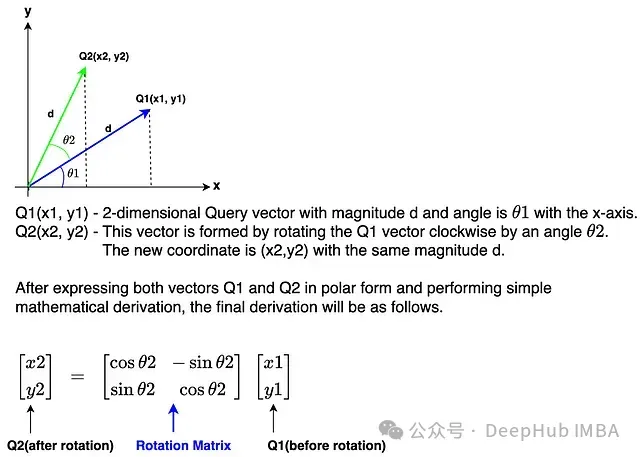
图4：应用于2维向量的旋转矩阵

上图展示了旋转矩阵应用于2维向量的情况。Llama 3模型中的维度数是4096，远高于此。我们详细介绍如何对更高维度的嵌入应用旋转。

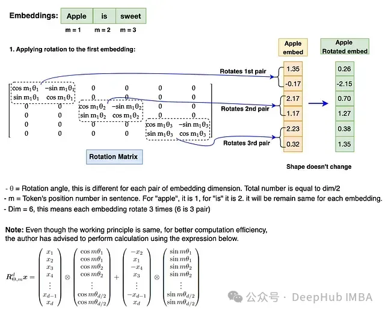
图5：RoPE应用于嵌入的示例


嵌入的旋转涉及每个嵌入位置(m)值和theta (θ)对每对嵌入维度的乘法。这就是RoPE如何通过实现旋转矩阵来捕获绝对位置和相对位置信息的方式。

注意：在执行旋转之前，需要将旋转矩阵转换为极坐标形式，并将嵌入向量转换为复数。旋转完成后，旋转后的嵌入需要转换回实数以进行注意力操作。另外RoPE仅应用于查询和键嵌入，不适用于值嵌入。

RoPE的代码实现：

```python
## 步骤2b: RoPE实现  
def precompute_freqs_cis(dim: int, seq_len: int, theta: float = 10000.0):
    # 计算每对维度的Theta值，即dim/2  
    device = ModelArgs.device
    freqs = 1.0 / (theta ** (torch.arange(0, dim, 2, device=device)[:(dim // 2)].float() / dim))

    # 计算序列中位置(m)的范围  
    t = torch.arange(seq_len, dtype=torch.float32, device=device)

    # freqs给出序列中所有标记位置的Theta值范围  
    freqs = torch.outer(t, freqs).to(device)

    # 这是需要转换为极坐标形式的旋转矩阵，以便对嵌入执行旋转  
    freqs_cis = torch.polar(torch.ones_like(freqs).to(device), freqs).to(device)
    return freqs_cis


def reshape_for_broadcast(freqs_cis, x):
    ndim = x.ndim
    assert 0 <= 1 < ndim
    assert freqs_cis.shape == (x.shape[1], x.shape[-1]), "freqs_cis的最后两个维度必须与x匹配"
    shape = [d if i == 1 or i == ndim - 1 else 1 for i, d in enumerate(x.shape)]
    return freqs_cis.view(*shape)


def apply_rotary_emb(xq: torch.Tensor, xk: torch.Tensor, freqs_cis: torch.Tensor) -> Tuple[torch.Tensor, torch.Tensor]:
    device = ModelArgs.device
    # 同时对查询和键嵌入应用旋转位置编码  
    # 首先：xq和xk嵌入的最后一个维度需要重塑为一对。因为旋转矩阵应用于每对维度。  
    # 其次：将xq和xk转换为复数，因为旋转矩阵只适用于复数  
    xq_ = torch.view_as_complex(xq.float().reshape(*xq.shape[:-1], -1, 2)).to(device)  # xq_:[bsz, seq_len, n_heads, head_dim/2]  
    xk_ = torch.view_as_complex(xk.float().reshape(*xk.shape[:-1], -1, 2)).to(device)  # xk_:[bsz, seq_len, n_heads, head_dim/2]  

    # 旋转矩阵(freqs_cis)在seq_len(dim=1)和head_dim(dim=3)维度上应与嵌入匹配  
    # 此外，freqs_cis的形状应与xq和xk相同，因此将freqs_cis的形状从[seq_len,head_dim]改变为[1,seq_len,1,head_dim]  
    freqs_cis = reshape_for_broadcast(freqs_cis, xq_)

    # 最后，通过与freqs_cis相乘执行旋转操作。  
    # 旋转完成后，将xq_out和xk_out转换回实数并返回  
    xq_out = torch.view_as_real(xq_ * freqs_cis).flatten(3).to(device)  # xq_out:[bsz, seq_len, n_heads, head_dim]  
    xk_out = torch.view_as_real(xk_ * freqs_cis).flatten(3).to(device)  # xk_out:[bsz, seq_len, n_heads, head_dim]  
    return xq_out.type_as(xq), xk_out.type_as(xk)

    ### RoPE代码测试 ###  


# 注：x_norm在RMSNorm测试中计算，这里用于测试。  
# 取消下面的三重引号来执行测试  
"""  
head_dim = ModelArgs.dim//ModelArgs.n_heads  
wq = nn.Linear(ModelArgs.dim, ModelArgs.n_heads * head_dim, bias=False, device=device)  
wk = nn.Linear(ModelArgs.dim, ModelArgs.n_kv_heads * head_dim, bias=False, device=device)  
xq = wq(x_norm)  
xk = wk(x_norm)  
print(f"xq.shape: {xq.shape}")  
print(f"xk.shape: {xk.shape}")  

xq = xq.view(xq.shape[0],xq.shape[1],ModelArgs.n_heads, head_dim)  
xk = xk.view(xk.shape[0],xk.shape[1],ModelArgs.n_kv_heads, head_dim)  
print(f"xq.re-shape: {xq.shape}")  
print(f"xk.re-shape: {xk.shape}")  

freqs_cis = precompute_freqs_cis(dim=head_dim, seq_len=ModelArgs.max_seq_len)  
print(f"freqs_cis.shape: {freqs_cis.shape}")  

xq_rotate, xk_rotate = apply_rotary_emb(xq, xk, freqs_cis)  
print(f"xq_rotate.shape: {xq_rotate.shape}")  
print(f"xk_rotate.shape: {xk_rotate.shape}")  
"""
### 测试结果: ###  
"""  
xq.shape: torch.Size([10, 256, 512])  
xk.shape: torch.Size([10, 256, 256])  
xq.re-shape: torch.Size([10, 256, 8, 64])  
xk.re-shape: torch.Size([10, 256, 4, 64])  
freqs_cis.shape: torch.Size([256, 32])  
xq_rotate.shape: torch.Size([10, 256, 8, 64])  
xk_rotate.shape: torch.Size([10, 256, 4, 64])  
"""
```

## KV缓存

在Llama 3架构中，推理阶段引入了KV缓存的概念，用于以键和值缓存的形式存储先前生成的标记。这些缓存用于计算自注意力以生成下一个标记。只缓存键和值标记，而不缓存查询标记，因此称为KV缓存。

### KV缓存的必要性

让我们通过下图来理解KV缓存的重要性。

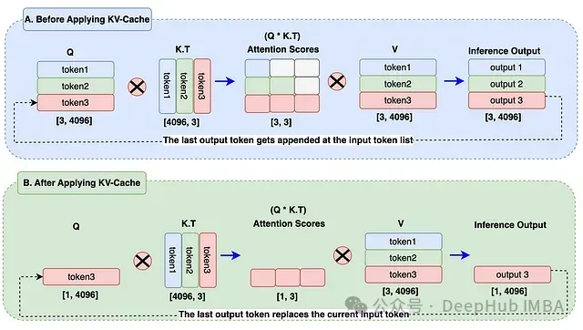
图6：KV缓存实现

图中的A块：在生成output3标记时，仍在计算先前的输出标记（output1, output2），这是不必要的。这在注意力计算期间导致了额外的矩阵乘法，显著增加了计算资源的使用。

图中的B块：输出标记替换了查询嵌入中的输入标记。KV缓存存储了先前生成的标记。在注意力分数计算期间，我们只需要使用查询中的1个标记，并使用键和值缓存中的先前标记。这将矩阵乘法从A块的3x3减少到B块的1x3，减少了约66%。在实际应用中，对于巨大的序列长度和批量大小，这将显著减少计算资源的使用。

## 分组查询注意力

分组查询注意力与之前模型（如Llama 1）中使用的多头注意力相似，唯一的区别在于为查询和键/值使用单独的头。分配给查询的头数是键和值头数的n倍。让我们通过图表来进一步理解。

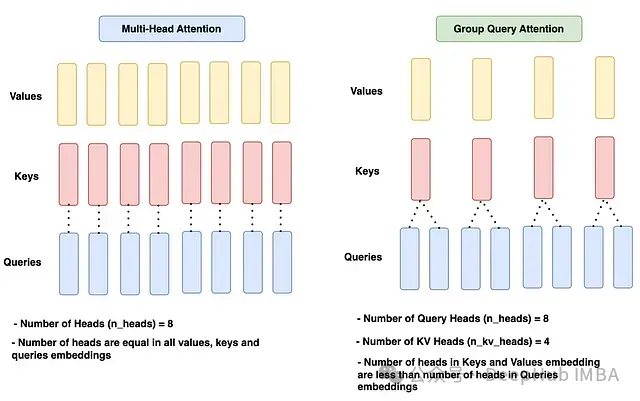
图7：分组查询注意力和多头注意力对比

在给定的图中，多头注意力在所有查询、键和值中都有相等数量的头，即n_heads = 8。

分组查询注意力块有8个查询头（n_heads）和4个键和值头（n_kv_heads），这是查询头数量的一半。

分组查询注意力的优势

尽管多头注意力已经表现出色，引入分组查询注意力是有其特定原因。我们先回顾KV缓存，KV缓存确实大大减少了计算资源的使用。但是随着KV缓存存储越来越多的先前标记，内存使用会显著增加。这对模型性能和计算成本都不利。所以引入了分组查询注意力。减少K和V的头数会减少需要存储的参数数量，从而减少内存使用。多项测试结果表明，使用这种方法模型的准确性仍保持在相近的范围内。

注意力模块的代码实现：

```python
## 注意力模块 [步骤2c: KV缓存; 步骤2d: 分组查询注意力]  
## 如前所述，命名约定遵循原始Meta LLama3 GitHub  

class Attention(nn.Module):
    def __init__(self, args: ModelArgs):
        super().__init__()
        self.args = args
        # 嵌入维度  
        self.dim = args.dim
        # 分配给查询的头数  
        self.n_heads = args.n_heads
        # 分配给键和值的头数。如果为"None"，则数量与查询相同。  
        self.n_kv_heads = args.n_heads if args.n_kv_heads is None else args.n_kv_heads
        # 每个头相对于模型维度的维度  
        self.head_dim = args.dim // args.n_heads
        # 重复次数，以使键、值头数与查询头数匹配  
        self.n_rep = args.n_heads // args.n_kv_heads

        # 初始化键、查询、值和输出的权重。注意q和kv的权重out_feature值基于其头数  
        self.wq = nn.Linear(self.dim, self.n_heads * self.head_dim, bias=False, device=device)
        self.wk = nn.Linear(self.dim, self.n_kv_heads * self.head_dim, bias=False, device=device)
        self.wv = nn.Linear(self.dim, self.n_kv_heads * self.head_dim, bias=False, device=device)
        self.wo = nn.Linear(self.n_heads * self.head_dim, self.dim, bias=False, device=device)

        # 初始化缓存以在开始时存储键、值 (KV缓存实现)  
        self.cache_k = torch.zeros((args.max_batch_size, args.max_seq_len, self.n_kv_heads, self.head_dim), device=args.device)
        self.cache_v = torch.zeros((args.max_batch_size, args.max_seq_len, self.n_kv_heads, self.head_dim), device=args.device)

    def forward(self, x: torch.Tensor, start_pos, inference):
        # 输入嵌入的形状: [bsz,seq_len,dim]  
        bsz, seq_len, _ = x.shape
        # 掩码将在"训练"期间使用，由于使用KV缓存，"推理"不需要掩码。
        mask = None

        xq = self.wq(x)  # x[bsz,seq_len,dim]*wq[dim,n_heads * head_dim] -> q[bsz,seq_len,n_heads * head_dim]  
        xk = self.wk(x)  # x[bsz,seq_len,dim]*wq[dim,n_kv_heads * head_dim] -> k[bsz,seq_len,n_kv_heads * head_dim]  
        xv = self.wv(x)  # x[bsz,seq_len,dim]*wq[dim,n_kv_heads * head_dim] -> v[bsz,seq_len,n_kv_heads * head_dim]  

        # 根据头数重塑查询、键和值 (分组查询注意力实现)  
        xq = xq.view(bsz, seq_len, self.n_heads, self.head_dim)  # xq[bsz,seq_len,n_heads, head_dim]  
        xk = xk.view(bsz, seq_len, self.n_kv_heads, self.head_dim)  # xk[bsz,seq_len,n_kv_heads, head_dim]  
        xv = xv.view(bsz, seq_len, self.n_kv_heads, self.head_dim)  # xv[bsz,seq_len,n_kv_heads, head_dim]  

        # 模型 - 推理模式: kv-cache仅在推理模式下启用  
        if inference:
            # 计算序列中每个位置的旋转矩阵  
            freqs_cis = precompute_freqs_cis(dim=self.head_dim, seq_len=self.args.max_seq_len * 2)
            # 在推理过程中,我们应该只取从当前标记位置开始的旋转矩阵范围  
            freqs_cis = freqs_cis[start_pos: start_pos + seq_len]
            # 将RoPE应用于查询和键嵌入  
            xq, xk = apply_rotary_emb(xq, xk, freqs_cis)

            self.cache_k = self.cache_k.to(xq)
            self.cache_v = self.cache_v.to(xq)
            # 将键和值标记嵌入存储到它们各自的缓存中 [KV缓存实现]  
            self.cache_k[:bsz, start_pos:start_pos + seq_len] = xk
            self.cache_v[:bsz, start_pos:start_pos + seq_len] = xv

            # 为注意力计算分配所有直到当前标记位置的先前标记嵌入给键和值变量  
            keys = self.cache_k[:bsz, :start_pos + seq_len]
            values = self.cache_v[:bsz, :start_pos + seq_len]

            # 此时,键和值的形状与查询嵌入不同,但为了计算注意力分数,它们必须相同  
            # 使用repeat_kv函数使键、值的形状与查询形状相同  
            keys = repeat_kv(keys, self.n_rep)  # keys[bsz,seq_len,n_heads,head_dim]  
            values = repeat_kv(values, self.n_rep)  # values[bsz,seq_len,n_heads,head_dim]  

        # 模式 - 训练模式: 未实现KV-Cache  
        else:
            # 计算旋转矩阵并将RoPE应用于训练的查询和键  
            freqs_cis = precompute_freqs_cis(dim=self.head_dim, seq_len=self.args.max_seq_len)

            # xq[bsz,seq_len,n_heads, head_dim], xk[bsz,seq_len,n_heads, head_dim]  
            xq, xk = apply_rotary_emb(xq, xk, freqs_cis)

            # 使用repeat_kv函数使键、值的形状与查询形状相同  
            # keys[bsz,seq_len,n_heads,head_dim], #values[bsz,seq_len,n_heads,head_dim]  
            keys = repeat_kv(xk, self.n_rep)
            values = repeat_kv(xv, self.n_rep)

            # 对于训练模式,我们将计算掩码并稍后应用于注意力分数  
            mask = torch.full((seq_len, seq_len), float("-inf"), device=self.args.device)
            mask = torch.triu(mask, diagonal=1).to(self.args.device)

            # 为了计算注意力,我们需要执行转置操作来重塑所有查询、键和值,将头部放在维度1,序列放在维度2  
        xq = xq.transpose(1, 2)  # xq[bsz,n_heads,seq_len,head_dim]  
        keys = keys.transpose(1, 2)  # keys[bsz,n_heads,seq_len,head_dim]  
        values = values.transpose(1, 2)  # values[bsz,n_heads,seq_len,head_dim]  

        # 计算注意力分数  
        scores = torch.matmul(xq, keys.transpose(2, 3)).to(self.args.device) / math.sqrt(self.head_dim)
        if mask is not None:
            scores = scores + mask

            # 对注意力分数应用softmax  
        scores = F.softmax(scores.float(), dim=-1).type_as(xq)
        # 注意力分数与值的矩阵乘法  
        output = torch.matmul(scores, values).to(self.args.device)

        # 我们得到了每个头部的上下文嵌入  
        # 所有头部需要重塑回来并组合,以给出单个上下文注意力输出  
        # 形状变化: output[bsz,n_heads,seq_len,head_dim] -> output[bsz,seq_len, n_heads,head_dim] -> output[bsz,seq_len, n_heads * head_dim]  
        output = output.transpose(1, 2).contiguous().view(bsz, seq_len, -1)

        # 形状: output [bsz,seq_len,dim]  
        return self.wo(output)

    # 如果键/值头的数量少于查询头,此函数使用所需的重复次数扩展键/值嵌入  


def repeat_kv(x: torch.Tensor, n_rep: int) -> torch.Tensor:
    bsz, seq_len, n_kv_heads, head_dim = x.shape
    if n_rep == 1:
        return x
    return (
        x[:, :, :, None, :]
        .expand(bsz, seq_len, n_kv_heads, n_rep, head_dim)
        .reshape(bsz, seq_len, n_kv_heads * n_rep, head_dim)
    )


### 测试: Repeat_kv函数 ###  
# 注: xk, x_norm已在RoPE, RMSNorm测试中计算,这里用于测试  
# 取消下面的三重引号来执行测试  
"""  
n_rep = ModelArgs.n_heads // ModelArgs.n_kv_heads  
keys = repeat_kv(xk, n_rep)  
print(f"xk.shape: {xk.shape}")  
print(f"keys.shape: {keys.shape}")  

## 测试: Attention函数  
# 取消下面的三重引号来执行测试  

attention = Attention(ModelArgs)  
x_out = attention(x_norm,start_pos=0, inference=False)  
print(f"x_out.shape: {x_out.shape}")  
"""
### 测试结果: ###  
"""  
xk.shape: torch.Size([10, 256, 4, 64])  
keys.shape: torch.Size([10, 256, 8, 64])  
x_out.shape: torch.Size([10, 256, 512])  
"""
```


## 前馈网络 (使用SwiGLU激活函数)

如图1所示,注意力输出首先经过RMSNorm,然后输入前馈网络。在前馈网络中,注意力输出嵌入会在其隐藏层中扩展到更高维度,学习标记的更复杂特征。

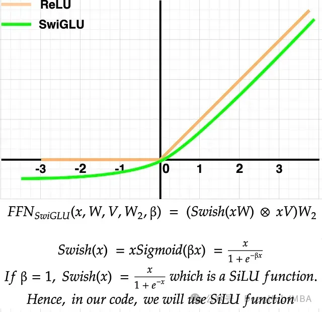
图8：带有SwiGLU函数的前馈网络

如图所示,SwiGLU函数在正轴上的行为与ReLU相似。然而,在负轴上,SwiGLU输出一些负值,这在学习较小值时可能有用,而不是像ReLU那样在负轴上为平坦的0。根据作者的研究,使用SwiGLU的性能优于ReLU,因此被选用。

前馈网络的代码实现：

```python
## 步骤2e: 前馈网络 (SwiGLU激活)  
class FeedForward(nn.Module):
    def __init__(self, dim: int, hidden_dim: int, multiple_of: int, ffn_dim_multiplier: Optional[float]):
        super().__init__()
        # 模型嵌入维度  
        self.dim = dim

        # 我们必须使用Meta提供的隐藏维度计算方法,这是该模型的理想设置  
        # 隐藏维度的计算方式使其是256的倍数  
        hidden_dim = int(2 * hidden_dim / 3)
        if ffn_dim_multiplier is not None:
            hidden_dim = int(ffn_dim_multiplier * hidden_dim)
        hidden_dim = multiple_of * ((hidden_dim + multiple_of - 1) // multiple_of)

        # 定义隐藏层权重  
        self.w1 = nn.Linear(self.dim, hidden_dim, bias=False, device=device)
        self.w2 = nn.Linear(hidden_dim, self.dim, bias=False, device=device)
        self.w3 = nn.Linear(self.dim, hidden_dim, bias=False, device=device)

    def forward(self, x):
        # 形状: [bsz,seq_len,dim]  
        return self.w2(F.silu(self.w1(x)) * self.w3(x))

    ### 测试: 前馈模块 ###  


# 注: x_out已在Attention测试中计算,这里用于测试  
# 取消下面的三重引号来执行测试  
"""  
feed_forward = FeedForward(ModelArgs.dim, 4 * ModelArgs.dim, ModelArgs.multiple_of, ModelArgs.ffn_dim_multiplier)  
x_out = rms_norm(x_out)  
x_out = feed_forward(x_out)  
print(f"前馈输出: x_out.shape: {x_out.shape}")  
"""

### 测试结果: ###  
"""  
前馈输出: x_out.shape: torch.Size([10, 256, 512])  
"""
```

## 解码器块

如图1所示,解码器块由多个子组件组成,我们在前面的部分中已经实现了这些组件。以下是解码器块内进行的逐步操作:

1. 来自输入模块的嵌入首先经过注意力-RMSNorm,然后输入分组查询注意力模块。

2. 同时,来自输入模块的原始嵌入与注意力输出相加。

3. 然后,这个结果经过前馈-RMSNorm,输入前馈网络模块。

4. 前馈网络的输出再次与步骤2的结果相加。

5. 最终输出被称为解码器输出。这个解码器输出然后作为输入传递给下一个解码器块。这个过程在接下来的31个解码器块中重复。第32个解码器块的最终输出然后传递到输出模块。

解码器块的代码实现：

```python
## 步骤2f: 解码器块。类名为TransformerBlock,以匹配Meta Llama 3代码库  

class TransformerBlock(nn.Module):
    def __init__(self, args: ModelArgs):
        super().__init__()
        self.args = args
        # 初始化注意力的RMSNorm  
        self.attention_norm = RMSNorm(dim=args.dim, eps=args.norm_eps)
        # 初始化注意力类  
        self.attention = Attention(args)
        # 初始化前馈网络的RMSNorm  
        self.ff_norm = RMSNorm(dim=args.dim, eps=args.norm_eps)
        # 初始化前馈网络类  
        self.feedforward = FeedForward(args.dim, 4 * args.dim, args.multiple_of, args.ffn_dim_multiplier)

    def forward(self, x, start_pos, inference):
        # start_pos: 推理模式下的标记位置, inference: True表示推理模式,False表示训练模式  
        # 1) 将输入嵌入传递给attention_norm,然后传递给注意力模块  
        # 2) 注意力的输出与原始输入(归一化前)相加  
        h = x + self.attention(self.attention_norm(x), start_pos, inference)

        # 1) 将注意力输出传递给ff_norm，然后传递给前馈网络  
        # 2) 前馈网络的输出与注意力输出(ff_norm前)相加  
        out = h + self.feedforward(self.ff_norm(h))
        # 形状: [bsz,seq_len,dim]  
        return out

    ### 测试: TransformerBlock ###  


# 取消下面的三重引号来执行测试  
"""  
x = torch.randn((ModelArgs.max_batch_size, ModelArgs.max_seq_len, ModelArgs.dim), device=device)  
transformer_block = TransformerBlock(ModelArgs)  
transformer_block_out = transformer_block(x,start_pos=0, inference=False)  
print(f"transformer_block_out.shape: {transformer_block_out.shape}")  
"""

### 测试结果: ###  
"""  
transformer_block_out.shape: torch.Size([10, 64, 128])  
"""
```

# 3、输出模块

最后一个解码器块的输出将传入输出模块。它首先经过RMSNorm处理，然后传入线性层生成logits。接下来根据模式的不同，会执行以下两种操作之一：

如果是推理模式，计算top_p概率并生成下一个标记。如果达到最大生成长度或生成的下一个标记为句子结束标记，则停止生成。

如果是训练模式，使用目标标签计算损失，并重复训练直到达到最大epoch数。

下图展示了输出模块的流程：

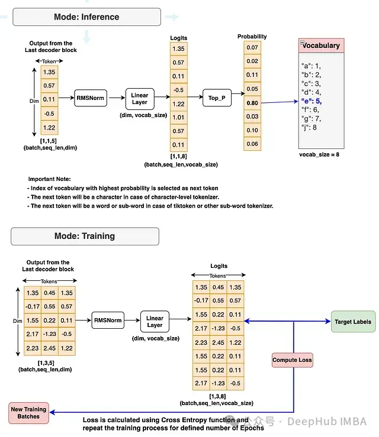
图9：Llama 3在训练和推理模式下的输出流程图

最终的Llama 3模型实现

我们将组合三个模块（输入模块、解码器模块和输出模块）的所有组件。这就构成了我们的完整Llama 3模型。

```python
## 步骤3: 输出模块  
# 这是Llama 3模型。类名保持为Transformer以匹配Meta Llama 3模型  

class Transformer(nn.Module):
    def __init__(self, params: ModelArgs):
        super().__init__()
        # 设置params变量中的所有ModelArgs  
        self.params = params
        # 从输入模块初始化嵌入类  
        self.tok_embeddings = nn.Embedding(params.vocab_size, params.dim)

        # 初始化解码器块并将其存储在ModuleList中  
        # 这是因为我们的Llama 3模型中有4个解码器块 (官方Llama 3有32个块)  
        self.layers = nn.ModuleList()
        for layer_id in range(params.n_layers):
            self.layers.append(TransformerBlock(args=params))

            # 为输出模块初始化RMSNorm  
        self.norm = RMSNorm(params.dim, eps=params.norm_eps)

        # 在输出模块初始化线性层  
        self.output = nn.Linear(params.dim, params.vocab_size, bias=False)

    def forward(self, x, start_pos=0, targets=None):

        # start_pos: 推理模式的标记位置, inference: True表示推理模式, False表示训练模式  
        # x是使用分词器从文本或提示生成的标记ID批次  
        # x[bsz, seq_len] -> h[bsz, seq_len, dim]  
        h = self.tok_embeddings(x)

        # 如果目标为None，则激活推理模式并设置为"True"，否则为训练模式"False"  
        inference = targets is None

        # 嵌入(h)然后将通过所有解码器块  
        for layer in self.layers:
            h = layer(h, start_pos, inference)

            # 最后解码器块的输出将馈入RMSNorm  
        h = self.norm(h)

        # 归一化后，嵌入h将馈入线性层  
        # 线性层的主要任务是生成将嵌入映射到词汇表大小的logits  
        # h[bsz, seq_len, dim] -> logits[bsz, seq_len, vocab_size]  
        logits = self.output(h).float()
        loss = None

        # 如果目标不可用，则为推理模式  
        if targets is None:
            loss = None
            # 如果目标可用，则为训练模式。计算损失以进行进一步的模型训练  
        else:
            loss = F.cross_entropy(logits.view(-1, self.params.vocab_size), targets.view(-1))

        return logits, loss

    ### 测试: Transformer (Llama模型) ###  


# 取消下面的三重引号来执行测试  
"""  
model = Transformer(ModelArgs).to(ModelArgs.device)  
print(model)  
"""
```

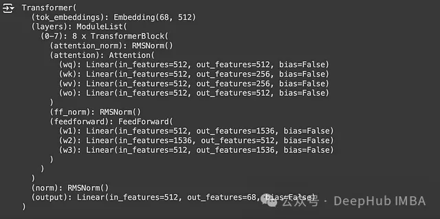
图10: Llama 3分层架构

我们刚刚构建的Llama 3模型结构看起来很完整。现在我们可以开始训练过程了。

# 4、训练Llama 3模型

训练流程在输出模块流程图（图9）中已经展示。在开始训练之前，让我们先实现训练代码。以下代码块中包含了必要的解释。

```python
## 步骤4: 训练Llama 3模型:  

# 使用我们在输入模块部分构建的分词器的encode函数，通过对整个tiny_shakespeare数据进行编码来创建数据集  
dataset = torch.tensor(encode(data), dtype=torch.int).to(ModelArgs.device)
print(f"dataset-shape: {dataset.shape}")


# 定义函数从给定数据集生成批次  
def get_dataset_batch(data, split, args: ModelArgs):
    seq_len = args.max_seq_len
    batch_size = args.max_batch_size
    device = args.device

    train = data[:int(0.8 * len(data))]
    val = data[int(0.8 * len(data)): int(0.9 * len(data))]
    test = data[int(0.9 * len(data)):]

    batch_data = train
    if split == "val":
        batch_data = val
    elif split == "test":
        batch_data = test

        # 从数据集中选择随机起点，为训练、验证和测试提供随机样本  
    ix = torch.randint(0, len(batch_data) - seq_len - 3, (batch_size,)).to(device)
    x = torch.stack([torch.cat([token_bos, batch_data[i:i + seq_len - 1]]) for i in ix]).long().to(device)
    y = torch.stack([torch.cat([batch_data[i + 1:i + seq_len], token_eos]) for i in ix]).long().to(device)

    return x, y


### 测试: get_dataset函数 ###  
"""  
xs, ys = get_dataset_batch(dataset, split="train", args=ModelArgs)  
print([(decode(xs[i].tolist()), decode(ys[i].tolist())) for i in range(len(xs))])  
"""


# 定义evaluate_loss函数来计算和存储训练和验证损失，用于日志记录和绘图  
@torch.no_grad()
def evaluate_loss(model, args: ModelArgs):
    out = {}
    model.eval()

    for split in ["train", "val"]:
        losses = []
        for _ in range(10):
            xb, yb = get_dataset_batch(dataset, split, args)
            _, loss = model(x=xb, targets=yb)
            losses.append(loss.item())
        out[split] = np.mean(losses)

    model.train()
    return out


# 定义训练函数来执行模型训练  
def train(model, optimizer, args: ModelArgs):
    epochs = args.epochs
    log_interval = args.log_interval
    device = args.device
    losses = []
    start_time = time.time()

    for epoch in range(epochs):
        optimizer.zero_grad()

        xs, ys = get_dataset_batch(dataset, 'train', args)
        xs = xs.to(device)
        ys = ys.to(device)
        logits, loss = model(x=xs, targets=ys)
        loss.backward()
        optimizer.step()

        if epoch % log_interval == 0:
            batch_time = time.time() - start_time
            x = evaluate_loss(model, args)
            losses.append(x)
            print(f"Epoch {epoch} | val loss {x['val']:.3f} | Time {batch_time:.3f}")
            start_time = time.time()

            # 打印最终验证损失  
    print("验证损失: ", losses[-1]['val'])
    # 在图表中显示间隔损失  
    pd.DataFrame(losses).plot()
    plt.savefig("losses.png")
    torch.save(model.state_dict(), f"model-{epoch}.pth")
    return 0
```

定义完训练函数。就可以开始训练过程，并在训练完成后观察结果。

```python
## 开始训练我们的Llama 3模型  
model = Transformer(ModelArgs).to(ModelArgs.device)
optimizer = torch.optim.Adam(model.parameters())

train(model, optimizer, ModelArgs)
```

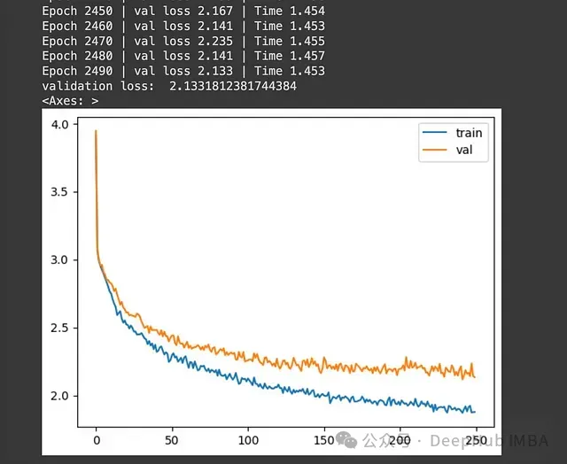
图11. 训练与验证损失图

上图显示了训练和验证损失的变化。训练进行了2500个epoch。使用Google Colab的默认GPU和RAM设置，整个训练过程大约花费了10分钟，这是相当快速的。最后一个epoch的验证损失为2.19，考虑到我们使用的训练数据量和epoch数量，这个结果是可以接受的。要显著降低损失，我们还需要增加训练数据的规模、提高epoch数量，并使用更强大的GPU或处理能力。

# 5、Llama 3模型推理

推理流程在输出模块流程图（图9）中已经展示。让我们实现推理代码。

```python
## 步骤5: Llama 3模型推理  
# 这个函数使用我们构建和训练的Llama 3模型，基于提供的提示生成文本序列  

def generate(model, prompts: str, params: ModelArgs, max_gen_len: int = 500, temperature: float = 0.6, top_p: float = 0.9):
    # prompt_tokens: 用户输入文本或提示列表  
    # max_gen_len: 生成文本序列的最大长度  
    # temperature: 用于控制采样随机性的温度值。默认为0.6  
    # top_p: 从logits采样prob输出的top-p概率阈值。默认为0.9  
    bsz = 1  # 对于推理，通常用户只输入一个提示，我们将其作为1个批次  
    prompt_tokens = token_bos.tolist() + encode(prompts)
    assert len(prompt_tokens) <= params.max_seq_len, "提示标记长度应小于max_seq_len"
    total_len = min(len(prompt_tokens) + max_gen_len, params.max_seq_len)

    # 这个tokens矩阵用于存储输入提示和模型生成的所有输出  
    # 稍后我们将使用分词器的decode函数来解码这个token，以文本格式查看结果  
    tokens = torch.full((bsz, total_len), fill_value=token_pad.item(), dtype=torch.long, device=params.device)

    # 将提示tokens填入token矩阵  
    tokens[:, :len(prompt_tokens)] = torch.tensor(prompt_tokens, dtype=torch.long, device=params.device)

    # 创建一个prompt_mask_token，用于稍后识别token是提示token还是填充token  
    # 如果是提示token则为True，如果是填充token则为False  
    input_text_mask = tokens != token_pad.item()

    # 现在我们可以从第一个位置开始，一次使用一个token从prompt_tokens列表开始推理  
    prev_pos = 0
    for cur_pos in range(1, total_len):
        with torch.no_grad():
            logits, _ = model(x=tokens[:, prev_pos:cur_pos], start_pos=prev_pos)
        if temperature > 0:
            probs = torch.softmax(logits[:, -1] / temperature, dim=-1)
            next_token = sample_top_p(probs, top_p)
        else:
            next_token = torch.argmax(logits[:, -1], dim=-1)

        next_token = next_token.reshape(-1)

        # 只有在是填充token时才替换token  
        next_token = torch.where(input_text_mask[:, cur_pos], tokens[:, cur_pos], next_token)
        tokens[:, cur_pos] = next_token

        prev_pos = cur_pos
        if tokens[:, cur_pos] == token_pad.item() and next_token == token_eos.item():
            break

    output_tokens, output_texts = [], []

    for i, toks in enumerate(tokens.tolist()):
        if token_eos.item() in toks:
            eos_idx = toks.index(token_eos.item())
            toks = toks[:eos_idx]

        output_tokens.append(toks)
        output_texts.append(decode(toks))
    return output_tokens, output_texts


# 对概率分布执行top-p (nucleus) 采样  
# probs (torch.Tensor): 由logits导出的概率分布张量  
# p: top-p采样的概率阈值  
# 根据相关研究，Top-p采样选择累积概率质量超过阈值p的最小标记集  
# 基于选定的标记重新归一化分布  
def sample_top_p(probs, p):
    probs_sort, prob_idx = torch.sort(probs, dim=-1, descending=True)
    probs_sum = torch.cumsum(probs_sort, dim=-1)
    mask = probs_sum - probs_sort > p
    probs_sort[mask] = 0.0
    probs_sort.div_(probs_sort.sum(dim=-1, keepdim=True))
    next_token = torch.multinomial(probs_sort, num_samples=1)
    next_token = torch.gather(prob_idx, -1, next_token)
    # 返回从词汇表中采样的标记索引  
    return next_token
```

对新的提示执行推理，并检查生成的输出：

```python
## 对用户输入的提示执行推理  
prompts = "Consider you what services he has done"
output_tokens, output_texts = generate(model, prompts, ModelArgs)
output_texts = output_texts[0].replace("<|begin_of_text|>", "")
print(output_texts)

## 输出 ##  
"""  
Consider you what services he has done o eretrane  
adetranytnn i eey i ade hs rcuh i eey,ad hsatsTns rpae,T  
eon o i hseflns o i eee ee hs ote i ocal ersl,Bnnlnface  
o i hmr a il nwye ademto nt i a ere  
h i ees.  
Frm oe o etrane o oregae,alh,t orede i oeral  
"""
```

从结果可以看出，我们的Llama 3模型能够对新的提示执行推理并生成文本。虽然考虑到我们使用的训练数据量和训练轮数，输出质量并不是很高，但这证明了模型的基本功能是正常的。通过使用更大规模的训练数据和更多的训练轮数，我们将能够获得更高质量的输出。

# 总结

我们已经成功地从零开始构建了自己的Llama 3模型。我们不仅实现了模型的架构，还成功地进行了训练，并能够执行推理以生成新的文本。值得注意的是，我们在相对有限的计算资源（Google Colab Notebook提供的免费GPU和RAM）下，在较短的时间内完成了这个过程。

本文中的代码和方法主要用于教育和研究目的。在实际应用中，可能需要进行更多的优化和调整，以达到生产级别的性能和效果。